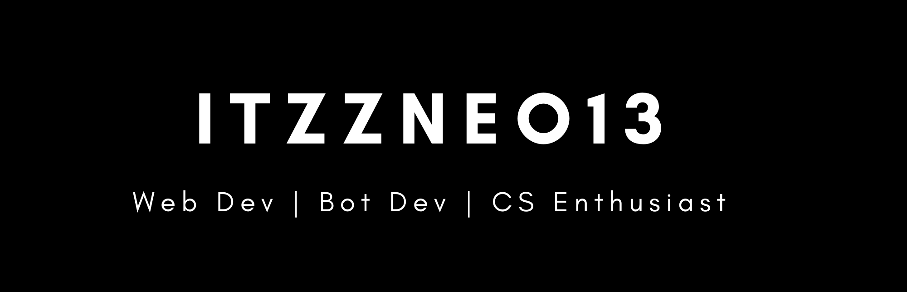

<h1 align="center">Hi 👋, I'm Prasad Ghaisas aka ItzzNeo13</h1>
<h3 align="center">A passionate Developer and CS Enthusiast from India</h3>

### About me -
- 🔭 I’m currently working on **improving my skills**

- 🌱 I’m currently learning **JavaScript**

- 📫 How to reach me - **My Instagram or Twitter**

- ⚡ Fun fact - **I have a organization that might help you. Check it out [here](https://github.com/TheMarkdownNerds)**

##
**Current social media stats** -

_Current Reddit Karma_ - 

_Current YouTube subscribers_ - 

_Current Twitter Followers_ - 

_Current Github Sponsors_ - 

_Current Profile Visits_ - 

#

<h3 align="center">Languages :</h3>
<div align="center">


</div>

#
<h4 align="center"> Softwares and OS:</h4>
<h5 align="center"> OS :</h5>
<div align="center">


 <h5 align="center"> Softwares I use :</h5>


</div>

#

### Top Used languages by me - 
<p></p>

#

💻 PC Info -

 ```
 OS: Windows 10 Home Single Language /n
 Version: 21H2
 OS Build: 19044.1526 
 Laptop: HP 15 Pentium 
 Processor: Intel(R) Pentium(R) CPU 6405U @ 2.40GHz
 RAM: 4.00 GB
 System type: 64-bit operating system, x64-based processor
 ```
 #
 
 👨‍💻 Softwares I use -
 ```
 Music: Spotify
 Browser: Brave & Tor
 Code Editor: VSCode
 Gfx(banners and logos): Canva
```

## My Current Activities -

### Discord Activity -

#

### Spotify Activity - 

[](https://spotify-github-profile.vercel.app/api/view?uid=dc90xmqlj32pxk5pqxwdyxt8w&redirect=true)

#


### All-time Github Stats -
  

#
### Repo Stats - 
<div align="center">


</div>

#

 
