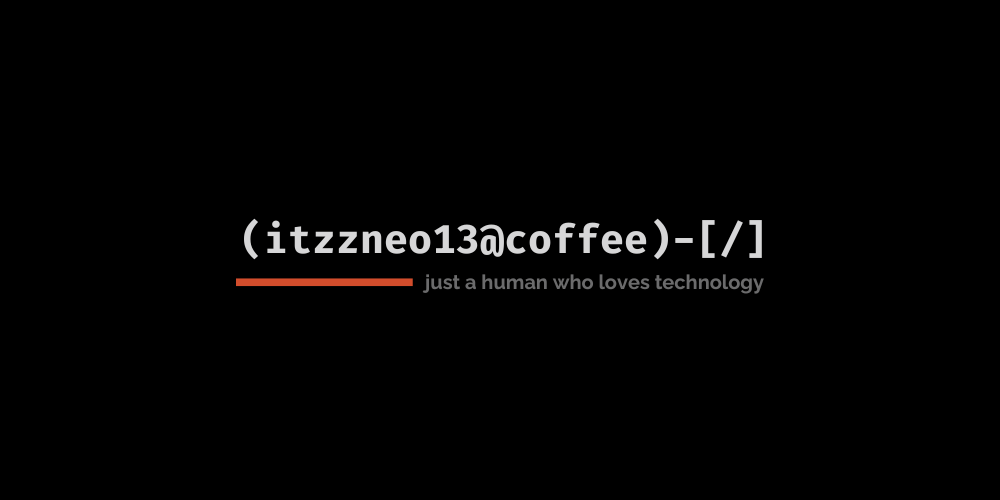

नमस्ते, Hallo & привет, Prasad here!
-----

<b>Hobbyist Developer | UI & Graphics Designer | Cybersec Enthusiast</b>

-----

#### About me -
 
 - Currently doing many tech and non-tech related things.

 - Open Source Advocate
 
- Contributed to: [@Team-Dark-Developers](https://github.com/Team-Dark-Developers)

- Reach out to me through [Mail](itzzneo13@proton.me) or [Website](https://itzzneo13.netlify.app/contact.html)

- At the moment this is the active side project: [Theme for VS Code](https://github.com/ItzzNeo13/Minimal-Theme)
 

-----

SOCIALS:

&ensp;
  &ensp;
  &ensp;
  

  ---

